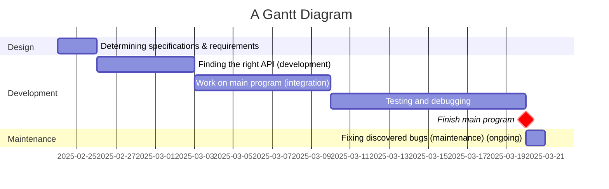
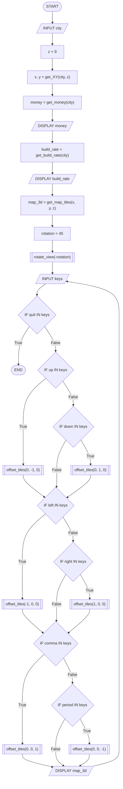
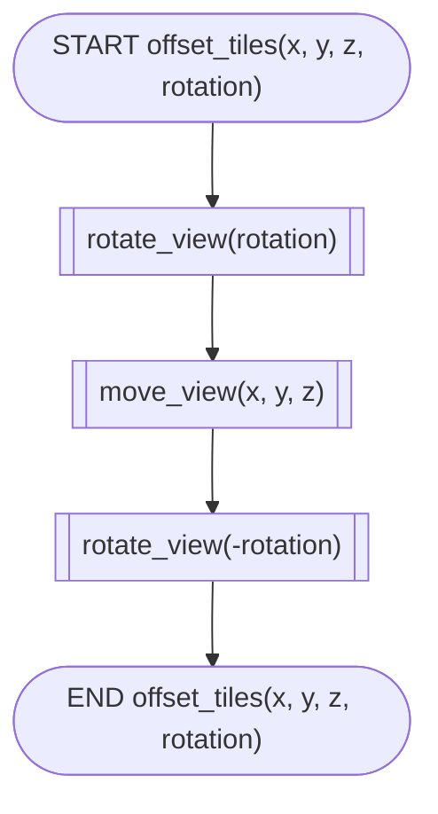
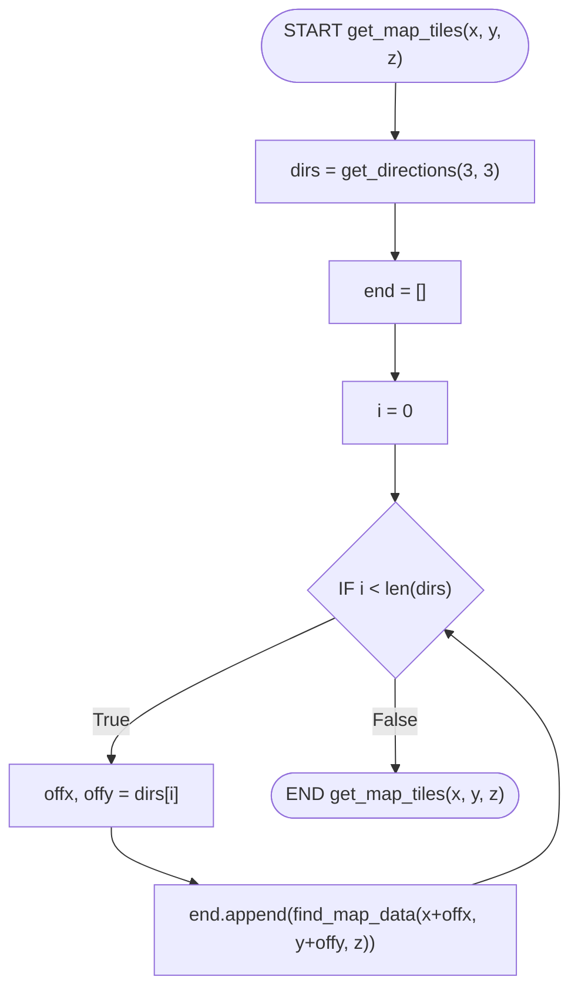

# Project overview
This project aims to provide users with a method for finding a city they would like to live in through displaying a 3D map of the city in addition to the price of housing and the amount of money the government has.
# Requirements definition
## Functional requirements
The user needs to be able to view a 3D environment of a city, and needs to be able to move the viewpoint around in the 3D environment with the keyboard to allow for users to see all the details of the data as necessary, and the user needs to be able to see where the roads, buildings, and other points of interest are and what the elevation looks like. The system also needs to display the current cost of a house in that city and how much money its government has.
## Non-functional requirements
The system needs to be able to tell the user when it's loading, as getting data from the web can take a while. The system needs to work all the time (when the user is connected to WIFI) and give descriptive error messages if not. After loading, the system needs to be fast and not laggy; getting at least 30 FPS. It also needs to be easily navigatable; with clear instructions on how to use it, as for some people the 3D UI may be a bit confusing without knowledge of how to use it.
# Determining specifications
## Functional specifications
The user needs to be able to choose a city and view data about it in 3D. The system needs to accept an input of a place and display 3D data about the city, such as elevation, roads, and other points of interest. The user should be able to use their keyboard as input to change their viewpoint in the 3D environment.
The system also needs to be able to handle errors gracefully, which could be having no WIFI, the API returning bad values, or the user inputting a city that does not exist.
## Non-functional specifications
The system should perform tasks as fast as possible, but since we're dealing with web requests, it could take a while. So, we need to show the user while it's loading. We also need to ensure it isn't laggy for user engagement, getting >=30 FPS. We can ensure this through having different quality settings that get auto-chosen based off of how fast the user's computer is. Data that might be incorrect can be an issue if the API changes over time, so the program needs to handle bad data and stop the program gracefully.
## Use case
Actor: User
Preconditions: Internet access, API is online and working.
Main flow:
1. User selects a city.
2. System gets data about government value and house prices and displays it.
3. System gets the data for the map about the city and displays it in 3D.
4. User moves around in the virtual world with the map data displayed; system updates display to the position.
Postconditions: None
# Design
## Gantt chart

## Structure chart

## Algorithms
```js
START
    INPUT city
    z = 9 // Zoom level
    x, y = get_XY(city, z)
    money = get_money(city)
    DISPLAY money
    build_rate = get_build_rate(city)
    DISPLAY build_rate
    map_3d = get_map_tiles(x, y, z)
    rotation = 45 // Angle the viewpoint is at
    rotate_view(-rotation)
    WHILE true
        INPUT keys
        IF quit IN keys THEN
            BREAK
        ENDIF
        IF up IN keys THEN
            offset_tiles(0, -1, 0, rotation)
        ELSEIF down IN keys THEN
            offset_tiles(0, 1, 0, rotation)
        ENDIF
        IF left IN keys THEN
            offset_tiles(-1, 0, 0, rotation)
        ELSEIF right IN keys THEN
            offset_tiles(1, 0, 0, rotation)
        ENDIF
        IF comma IN keys THEN
            offset_tiles(0, 0, 1, rotation)
        ELSEIF period IN keys THEN
            offset_tiles(0, 0, -1, rotation)
        ENDIF
        DISPLAY map_3d
    ENDWHILE
END

START offset_tiles(x, y, z, rotation)
    rotate_view(rotation)
    move_view(x, y, z)
    rotate_view(-rotation)
END offset_tiles(x, y, z, rotation)

START get_map_tiles(x, y, z)
    dirs = get_directions(3, 3) // Amount of tiles
    end = []
    FOR i = 0 TO len(dirs)
        offx, offy = dirs[i]
        // They start as promises that don't render anything but then once the data comes it renders the data
        end.append(find_map_data(x+offx, y+offy, z))
    NEXT i
    RETURN end
END get_map_tiles(x, y, z)
```



## Data dictionary
| Variable | Data type | Format for display | Size in bytes | Size for display | Description | Example | Validation |
|--|--|--|--|--|--|--|--|

// TODO: What for?

# Development
// TODO: Add code blocks of old code???
# Integration
// TODO: What??????
> Remember to update your project documentation to include a code block of your integrated programs under the heading Integration
# Testing and debugging
// TODO: What??????
# Installation
See [main.py](./main.py)
# Maintenance
Over time, the API for the map might change, and so to compensate I would keep the github repo open for issues so users can log API problems or other bugs, so I can fix the code and get everyone to update and have it working again. Newer versions of openGL or requests might come out, and if there are any breaking changes I will pin specific versions in the requirements.txt so it will only install versions before the breaking changes. This all means that if things happen to the APIs or pip packages that this project will still survive, unless one were to go fully offline forever. Clear documentation on how to install and update and how to notify the creators of a bug is key, and will be stored in the README.md of the project for easy reference.
# Final Evaluation

