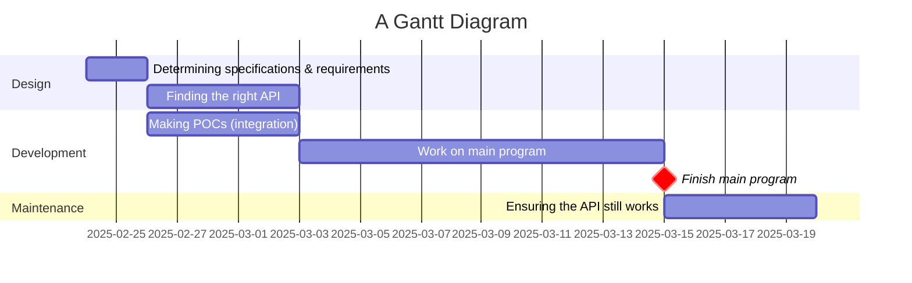

# Project overview
This project is a very simple version of sim city or civilization. It uses a map of Australia pulled from an API, and starts you off with current stats from Australia (economics, etc.).
# Requirements definition
## Functional requirements
The app needs to retrieve data from the internet about a city of the user's choice and display it in a 3D environment. The user needs to be able to see the 3D environment in a way that they can see all details of the data as necessary. The user should be able to use their keyboard to interact with the data viewing.
## Non-functional requirements
The system needs to be able to tell the user when it's loading, as getting data from the web can take a while. The system needs to work all the time (that the user is connected to WIFI) and give descriptive error messages if not. After loading, the system needs to be fast and not laggy; getting at least 30 FPS. It also needs to be easily navigatable; with clear instructions on how to use it.
# Determining specifications
## Functional specifications
The user needs to be able to choose a city and view data about it in 3D. The system needs to accept an input of a place and display 3D data about the city, such as elevation, roads, etc. Possible errors that need to be handled are a lack of WIFI, or the user inputting a city that does not exist.
## Non-functional specifications
The system should perform tasks as fast as possible, but since we're dealing with web requests, it could take a while. So, we need to show the user while it's loading. We also need to ensure it isn't laggy for user engagement, getting >=30 FPS. We can ensure this through having different quality settings that get auto-chosen based off of how fast the user's computer is. Data that might be incorrect can be an issue if the API changes over time, so the program needs to handle that and stop the program gracefully.
## Use case
Actor: User
Preconditions: Internet access, API is online and working.
Main flow:
1. User selects a city, system gets the data for the map about the city and displays it in 3D.
2. User moves around in the virtual world with the map data displayed; system updates display to the position.
Postconditions: None
# Design
## Gantt chart

## Structure chart

# Development
# Integration
# Testing and debugging
# Maintenance
