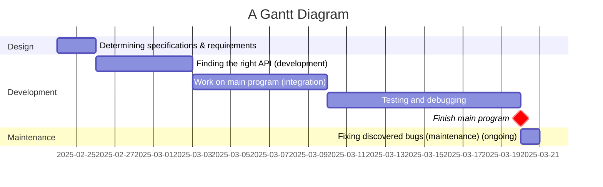

# Project overview
This project aims to provide users with an overview of a city (one use case being finding a city they would like to live in) through displaying a 3D map of the city in addition to the price of housing and the amount of money the government has.
# Requirements definition
## Functional requirements
The user needs to be able to view a 3D environment of a city, and needs to be able to move the viewpoint around in the 3D environment with the keyboard to allow for users to see all the details of the data as necessary, and the user needs to be able to see where the roads, buildings, and other points of interest are and what the elevation looks like. The system also needs to display the current cost of a house in that city and how much money its government has.
## Non-functional requirements
The system needs to be able to tell the user when it's loading, as getting data from the web can take a while. The system needs to work all the time (when the user is connected to WIFI) and give descriptive error messages if not working, for whatever reason. After loading, the system needs to be fast and not laggy; getting at least 30 FPS. It also needs to be easily navigatable; with clear instructions on how to use it, as for some people the 3D UI may be a bit confusing without knowledge of how to use it.
# Determining specifications
## Functional specifications
The user needs to be able to choose a city and view data about it in 3D. The system needs to accept an input of a place and display 3D data about the city, such as elevation, roads, and other points of interest, in addition to the house prices and current wealth the government has. The user should be able to use their keyboard as input to change their viewpoint in the 3D environment to see the data from many angles to understand it more.
The system also needs to be able to handle errors gracefully by telling the user what happened and allowing them to contact the github page with the error to fit it. Errors to handle could be having no WIFI, the API returning bad values, or the user inputting a city that does not exist.
## Non-functional specifications
The system should perform tasks as fast as possible, but since we're dealing with web requests, it could take a while. So, we need to show the user while it's loading. We also need to ensure it isn't laggy for user engagement, getting at least 30 FPS. We can ensure this through having different quality settings that get auto-chosen based off of how fast the user's computer is. Data that might be incorrect can be an issue if the API changes over time, so the program needs to find bad data and stop the program gracefully.
## Use case
Actor: User
Preconditions: Internet access, APIs are online and working.
Main flow:
1. User selects a city.
2. System gets data about government wealth and house prices and displays it.
3. System gets the data for the map about the city and displays it in 3D.
4. User moves around the 3D environment with the keyboard; system updates display to the position.
Postconditions: None
# Design
## Gantt chart

## Structure chart

## Algorithms
```js
START
    INPUT city
    z = 9 // Zoom level
    x, y = get_XY(city, z)
    money = get_money(city)
    DISPLAY money
    build_rate = get_build_rate(city)
    DISPLAY build_rate
    map_3d = get_map_tiles(x, y, z)
    rotation = 45 // Angle the viewpoint is at
    rotate_view(-rotation)
    WHILE true
        INPUT keys
        IF quit IN keys THEN
            BREAK
        ENDIF
        IF up IN keys THEN
            offset_tiles(0, -1, 0, rotation)
        ELSEIF down IN keys THEN
            offset_tiles(0, 1, 0, rotation)
        ENDIF
        IF left IN keys THEN
            offset_tiles(-1, 0, 0, rotation)
        ELSEIF right IN keys THEN
            offset_tiles(1, 0, 0, rotation)
        ENDIF
        IF comma IN keys THEN
            offset_tiles(0, 0, 1, rotation)
        ELSEIF period IN keys THEN
            offset_tiles(0, 0, -1, rotation)
        ENDIF
        DISPLAY map_3d
    ENDWHILE
END

START offset_tiles(x, y, z, rotation)
    rotate_view(rotation)
    move_view(x, y, z)
    rotate_view(-rotation)
END offset_tiles(x, y, z, rotation)

START get_map_tiles(x, y, z)
    dirs = get_directions(3, 3) // Amount of tiles
    end = []
    FOR i = 0 TO len(dirs)
        offx, offy = dirs[i]
        // They start as promises that don't render anything but then once the data comes it renders the data
        end.append(find_map_data(x+offx, y+offy, z))
    NEXT i
    RETURN end
END get_map_tiles(x, y, z)
```
[Interactive viewer for below chart](https://mermaid.live/view#pako:eNp9lGtvmzAYhf-K5U-JRBIcLglIm1QtrRRpiqo1k9ZBFLlgwGrAmQNLc_vvs-kQw7jzJ_A573mOLcEFRiwm0IfJjh2jDPMSrBdhAcRCg-BpffdtvRmORp_ft-SaBpPl6vH7GkS0PE02Hc0KzuAT8LqbdhDCNwOchJKScvvjeSAnDXAehrDrdIQzZwVprPVz7e5Z3WCyWD49fr17BrVLKTITSS8V3cVbjkvyN67d0GfO28zWqgR7siLeb6246SheSrojh4E8o-5UyAw4K3FJWSFmbEdRUSAiawPZ_qbkOBg1bpnUNcuFm_t_JafDpK-_XJYP4FdFS7Bc1Z6bsFzXvCLX-0Fwv1pshsqA1B_w7kCuUVeJZFS17wdFdWmWJAdxA--nNw0wQgYw69JKTAuIu0osATE7Fn1ErEV8REBijijZLVVVNG4im-xIork10m9Sn1RfhbTYpKskEsFpmmkYSZ_xH4TsnyrhLVZVNO5UVolYnuN-lVR78fLuNVXSFpt1lUwi9oRTFvcZ2UeMkRYiT0CV-BasKho3_edvUX-8EwVBxQwOC2jAlNMY-qVoacCc8BzLV3iR9hCWGclJCH3xGGP-GsKwuImZPS5-MpY3Y5xVada8VPtYfNkLilOOWwcpYsK_sKoooY88u46A_gW-Qd-de-Mpcm3LdF3bdKeOAU_Q96Zjc4YcNPNs27Icz74Z8FwzzfF8bnnI9ZAzm9vItqa3P3Ttmcg)

[Interactive viewer for below chart](https://mermaid.live/view#pako:eNqNjstugzAURH_FuisiATJgCHhRqSrZdtGwahxFVjAPNeDIMXkh_r2GJupz0bvyaM6Mp4etzAVQKHbytK240ihLWYvMLa0Vg2X2-JIhWRQHoTe63omDdbbRxUZXGympua5lO2OwnjnOw0dsPG9lopMtNsdanKyv6Pob6o9oI4838Fb-mwt-Vjp_dy7G1Yvn9D-bwYZS1TlQrTphQyNUw0cJ_djFQFeiEQyoeeZcvTFg7WAye96-StncY0p2ZXUX3T43C9Oal4p_EqLNhXqSXauBhv7UALSHs1Fh5PokjgkOAh8HnjEvQEnkkiQhQUiMh0mUDDZcpy-xm-AkDnE8j0gYxvPEG94BdseIbw)

[Interactive viewer for below chart](https://mermaid.live/view#pako:eNp9UE1vwjAM_SuRT0XrUGkDNNU2aRog7bLD4LQGoYymJVq_lBYNKP3vc4oQY0jzIbGd95790sC6iCQEEKfF93ojdE0WE54TjLkVcpgvnt8XJJH1KhPlqlaprKydTfY2OfQ4LHv3908ntIkBEiKlK_LYMTCV61oVeWV5NvEM_gruIlzmEaLD5d83L1TYd66btOHwOiOKPJBU5pYZhaItYo4LvZVHcYGaEKhfxDGui-ce5QwhVDezTHyedumLssTLilUedY4jUQtrd3eS2Zu7s37jhf5KzT4zkVbyOD11p-Ynp2-Tf_4RbEi0iiCo0YgNmdSZMCU0RoJDvZGZ5BBgGgn9xYHnLXJKkX8URXam6WKbbM7FtsTl5USJRIsLAt1J_VJs8xqCYScAQQM7CDzf67vU98eOT9nIYdSGPXZHfcoYdT3mO-OB67PWhkM30ekzh_lDxx8OHHdE2ZC1P3LyqD4)

## Data dictionary
The program needs to get feature data from the internet of all the map features such as roads and buildings. Here is the data dictionary for it:

| Variable   | Data type | Format for display | Size | Description | Example | Validation |
|------------|:---------:|:------------------:|------|-------------|:-------:|-----------:|
| type       | str       | XX..XX | Variable; string can be of any length | The type of shape                      | `"MultiPolygon"` | Only uses characters in the set `[a-zA-Z]`, at least 1 character, is a valid Shapely.Shape subclass name |
| coords     | Nested Arrays of floats | [[..[0.FFFF, 0.FFFF], ..]] | Variable; array can be with 0-2 nested arrays, which can be of any length except for the inner-most array which must have 2 floats | The coordinates of the shape with type `type` | `[[[8.5, 12.5], [1.25, 125.125]], [[0.1, 80.3], [400.5, 93.4]]]` | Must have 0-2 nested arrays consistantly across every array (i.e. no `[0, [1, 0]]`) and the inner-most array must contain 2 floats between 0-1 |
| importance | int       | NN     | 1 byte; 2 display characters          | The importance of the feature (should it be displayed in front of other elements or behind?) | 2 | Valid integer greater than 0 and not too big (shouldn't but can have values greater than ~10) or -1 |
| group      | str       | XX..XX | Variable; string can be of any length | The group the feature falls in         | `"water"`        | Only uses characters in the set `[a-zA-Z ]`, at least 1 character |
| kind       | str       | XX..XX | Variable; string can be of any length | The 'subgroup' of the feature          | `"riverbank"`    | Only uses characters in the set `[a-zA-Z ]`, at least 1 character |
| name       | str       | XX..XX | Variable; string can be of any length | The name of the feature, if it has one | `"Cooks River"`  | Only uses characters in the set `[a-zA-Z ]` |

# Development
Include a code block containing the entirety of `main.py` and `objs.py`
# Integration
Include a code block containing the entirety of `API.py`
# Testing and debugging
> Have at least 2 other students perform a system-level test and give feedback based off of functional and non-functional requirements, response time, load testing and the suitability of the requirements.txt and README.md file
## Name
> 
## Name2
>
# Installation
See [README.md](../README.md)
# Maintenance
Over time, the API for the map might change, and so to compensate I would keep the github repo open for issues so users can log API problems or other bugs, so I can fix the code and get everyone to update and have it working again. Newer versions of libraries such as OpenGL or requests might come out, and if there are any breaking changes I will pin specific versions in the requirements.txt so it will only install versions before the breaking changes. This all means that if things happen to the APIs or pip packages that this project will still survive, unless one were to go fully offline forever. Clear documentation on how to install and update and how to notify the creators of a bug is key, and will be stored in the README.md of the project for easy reference.
# Final Evaluation
I think this project mostly addressed the functional and non-functional requirements. Users are able to successfully view a map in 3D and get info about the city, but due to limitations in the avaliable APIs, the data is not of good enough quality; so there are many errors (specifically with the elevation and money); but it still addresses the core requirements that were set - users are able to make a judgement on where they would like to live through this project through looking at the environment. It may just be slightly inaccurate sometimes, meaning it will hinder the judgement a bit - so it could be improved with more complex parsing of the APIs (or more research to find working ones). Time management could have been improved - I think finding which APIs worked at the start was a good idea, but I shouldn't have tried to get the money API in because that just took way too long. But the only reason I did was because I had enough time - and in the end it turned out OK as I scrapped everything else that I couldn't get up to. In addition, it does not show very detailed data; it shows the roads and water and land, but it doesn't show it very detailed (it shows it drawn on the ground, not to a very high precision; and also some features need labels such as the POIs and they don't currently) which may hinder the functionality. Also, At the start, there were plans for more features such as FPS autoquality, but that was scrapped as it is too hard and one quality level will work for most users at the required frame rate anyway. But even through all these limitations, the code does an excellent job at displaying the map in 3D; making it quite valuable for its purpose of providing the users with an overview of a place.

