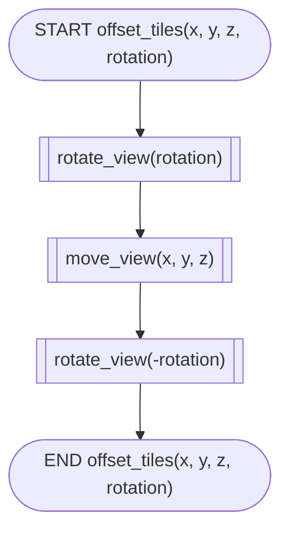

# Project overview
This project aims to provide users with an overview of a city, specifically for finding where a city they would like to live. This will be achieved through displaying a 3D map of the city containing elevation, roads, greenery and points of intrest in addition to the price of an apartment and the amount of money the government has. This could be a new feature for a real estate website.
# Requirements definition
## Functional requirements
1. The system must display 3D data about a city, such as elevation, roads, and other points of interest
2. The system also must display the apartment prices and current government wealth of the area
3. The user must be able to use their keyboard as input to change their viewpoint in the 3D environment to explore the data
4. The user needs to be able to see where all the details of the data are; that being roads, points of interest, greenery and oceans
5. The user must be able to clearly make out the elevation of the land
## Non-functional requirements
1. The system needs to be able to tell the user when it's loading, as getting data from the web can take a while
2. The system needs to work all the time (when the user is connected to WIFI) and give descriptive error messages if an error has occurred
3. After loading, the system needs to be fast and not laggy; getting at least 30 FPS on regular computers
4. The system also needs to be easily navigatable; with clear instructions on how to use it, as for some people the 3D UI may be a bit confusing without knowledge of how to use it
# Determining specifications
## Functional specifications
1. The user needs to be able to choose a city by inputting a city name into the system
2. The user needs to be able to view a 3D environment of the chosen city in a GUI window
3. The user needs to be able to move the viewpoint around in the 3D environment with the keyboard to see the data from multiple points of view
4. The user must also be able to see the current cost of an apartment in that country and how much money its government has
5. The system also needs to be able to handle errors gracefully by telling the user what happened and allowing them to go to the github page with the error so I can fix it. Errors to handle could be having no WIFI, the API returning bad values, or the user inputting a city that does not exist
## Non-functional specifications
1. The system should perform tasks as fast as possible, but since we're dealing with web requests, it could take a while. So, the program needs to tell the user when it's loading
2. It also needs to ensure it isn't laggy for user engagement, getting at least 30 FPS on regular computers
3. Data that might be incorrect can be an issue if the API changes over time, so the program needs to stop the program gracefully if it encounters incorrect data
4. To make the program more accessible, it will print the help messages and info to the terminal; so screen readers can pick it up
5. When it does error, it needs to gracefully stop and tell the user what happened, as well as telling them to put the error on the github page so I can fix it
## Use case
Actor: User (who is interested in looking into buying a house in a specific city)

Preconditions: Internet access, APIs are online and working.
Main flow:
1. User selects a city.
2. System gets data about government wealth and house prices and displays it.
3. System gets the data for the map about the city and displays it in 3D.
4. User moves around the 3D environment with the keyboard; system updates display to the position.
Postconditions: User can see where the roads, oceans, POIs and greenery are to find where in the city to look for a house.
# Design
## Gantt chart
[Interactive viewer for below chart](https://mermaid.live/view#pako:eNp1UkuL2zAQ_iuDDiUBO8gPJbZvpWahh0ChhbLFF9Wa2GJtyZXlZduQ_17JxptH6ZxG8jffY6wzqbVAUpCGK2srBa6stB3C17pFMXW43Alu8Umbnlsoy_B4DJ-flw8j1lZqBSWOslHLna8SLZpeKqkaGAes5UnW3CNH-AAGf03SYI_KjjO6iNOQxmHMAoj3S3dL5amhbrlxcK4EDCNOQnvn8E8VNAppMlNRtnSPTl-x04MXv2o8SSW8VdsiGNm0Fj5--QybkzbQuegGpLLYmDnB1tndr3adwI2Gr-_avIDT6blUMBjtpnrYiKvq9t4uW-1G7JHqG47Wu_KZBf6cmsaf_ldF9E4V00cqF1CO7b2p62QvOyelFQZQG2kDEL5dWVxKcb_DI_f7UFzVeCvx5u0JOdb6FQ0KcI5H2PRX8BY2WjXawdwS-ckvdlaKBAlIY6QghTUTBqR3j4f7Izl7gYq4H9NjRQrXCm5eKlKpi5sZuPqhdb-OGT017XqYBv9qS8l92HcEKoHmk56UJQWbCUhxJm-k2Ee7OM2yZM-iQ5IkeZYG5DcpYhrt0jxPGd1nCcuTA7sE5M-sSXc5zTNGs5ylNM0idrj8Bbhu868)

## Structure chart

## Algorithms
```js
START
    INPUT city
    z = 9 // Zoom level
    x, y = get_XY(city, z)
    money = get_money(city)
    DISPLAY money
    build_rate = get_build_rate(city)
    DISPLAY build_rate
    map_3d = get_map_tiles(x, y, z)
    rotation = 45 // Angle the viewpoint is at
    rotate_view(-rotation)
    WHILE true
        INPUT keys
        IF quit IN keys THEN
            BREAK
        ENDIF
        IF up IN keys THEN
            offset_tiles(0, -1, 0, rotation)
        ELSEIF down IN keys THEN
            offset_tiles(0, 1, 0, rotation)
        ENDIF
        IF left IN keys THEN
            offset_tiles(-1, 0, 0, rotation)
        ELSEIF right IN keys THEN
            offset_tiles(1, 0, 0, rotation)
        ENDIF
        IF comma IN keys THEN
            offset_tiles(0, 0, 1, rotation)
        ELSEIF period IN keys THEN
            offset_tiles(0, 0, -1, rotation)
        ENDIF
        DISPLAY map_3d
    ENDWHILE
END

START offset_tiles(x, y, z, rotation)
    rotate_view(rotation)
    move_view(x, y, z)
    rotate_view(-rotation)
END offset_tiles(x, y, z, rotation)

START get_map_tiles(x, y, z)
    dirs = get_directions(3, 3) // Amount of tiles
    end = []
    FOR i = 0 TO len(dirs)
        offx, offy = dirs[i]
        // They start as promises that don't render anything but then once the data comes it renders the data
        end.append(find_map_data(x+offx, y+offy, z))
    NEXT i
    RETURN end
END get_map_tiles(x, y, z)
```
[Interactive viewer for below chart](https://mermaid.live/view#pako:eNp9lGtvmzAYhf-K5U-JRBIcLglIm1QtrRRpiqo1k9ZBFLlgwGrAmQNLc_vvs-kQw7jzJ_A573mOLcEFRiwm0IfJjh2jDPMSrBdhAcRCg-BpffdtvRmORp_ft-SaBpPl6vH7GkS0PE02Hc0KzuAT8LqbdhDCNwOchJKScvvjeSAnDXAehrDrdIQzZwVprPVz7e5Z3WCyWD49fr17BrVLKTITSS8V3cVbjkvyN67d0GfO28zWqgR7siLeb6246SheSrojh4E8o-5UyAw4K3FJWSFmbEdRUSAiawPZ_qbkOBg1bpnUNcuFm_t_JafDpK-_XJYP4FdFS7Bc1Z6bsFzXvCLX-0Fwv1pshsqA1B_w7kCuUVeJZFS17wdFdWmWJAdxA--nNw0wQgYw69JKTAuIu0osATE7Fn1ErEV8REBijijZLVVVNG4im-xIork10m9Sn1RfhbTYpKskEsFpmmkYSZ_xH4TsnyrhLVZVNO5UVolYnuN-lVR78fLuNVXSFpt1lUwi9oRTFvcZ2UeMkRYiT0CV-BasKho3_edvUX-8EwVBxQwOC2jAlNMY-qVoacCc8BzLV3iR9hCWGclJCH3xGGP-GsKwuImZPS5-MpY3Y5xVada8VPtYfNkLilOOWwcpYsK_sKoooY88u46A_gW-Qd-de-Mpcm3LdF3bdKeOAU_Q96Zjc4YcNPNs27Icz74Z8FwzzfF8bnnI9ZAzm9vItqa3P3Ttmcg)

[Interactive viewer for below chart](https://mermaid.live/view#pako:eNqNjstugzAURH_FuisiATJgCHhRqSrZdtGwahxFVjAPNeDIMXkh_r2GJupz0bvyaM6Mp4etzAVQKHbytK240ihLWYvMLa0Vg2X2-JIhWRQHoTe63omDdbbRxUZXGympua5lO2OwnjnOw0dsPG9lopMtNsdanKyv6Pob6o9oI4838Fb-mwt-Vjp_dy7G1Yvn9D-bwYZS1TlQrTphQyNUw0cJ_djFQFeiEQyoeeZcvTFg7WAye96-StncY0p2ZXUX3T43C9Oal4p_EqLNhXqSXauBhv7UALSHs1Fh5PokjgkOAh8HnjEvQEnkkiQhQUiMh0mUDDZcpy-xm-AkDnE8j0gYxvPEG94BdseIbw)

[Interactive viewer for below chart](https://mermaid.live/view#pako:eNp9UE1vwjAM_SuRT0XrUGkDNNU2aRog7bLD4LQGoYymJVq_lBYNKP3vc4oQY0jzIbGd95790sC6iCQEEKfF93ojdE0WE54TjLkVcpgvnt8XJJH1KhPlqlaprKydTfY2OfQ4LHv3908ntIkBEiKlK_LYMTCV61oVeWV5NvEM_gruIlzmEaLD5d83L1TYd66btOHwOiOKPJBU5pYZhaItYo4LvZVHcYGaEKhfxDGui-ce5QwhVDezTHyedumLssTLilUedY4jUQtrd3eS2Zu7s37jhf5KzT4zkVbyOD11p-Ynp2-Tf_4RbEi0iiCo0YgNmdSZMCU0RoJDvZGZ5BBgGgn9xYHnLXJKkX8URXam6WKbbM7FtsTl5USJRIsLAt1J_VJs8xqCYScAQQM7CDzf67vU98eOT9nIYdSGPXZHfcoYdT3mO-OB67PWhkM30ekzh_lDxx8OHHdE2ZC1P3LyqD4)

## Data dictionary
The program needs to get feature data from the internet of all the map features such as roads and buildings. Here is the data dictionary for it:

| Variable   | Data type | Format for display | Size | Description | Example | Validation |
|------------|:---------:|:------------------:|------|-------------|:-------:|-----------:|
| type       | str       | XX..XX | Variable; string can be of any length | The shape type                 | `"MultiPolygon"` | Only uses characters in the set `[a-zA-Z]`, at least 1 character, is a valid Shapely.Shape subclass name |
| coords     | Nested Arrays of floats | [[..[0.FFFF, 0.FFFF], ..]] | Variable; array can be with 0-2 nested arrays, which can be of any length except for the inner-most array which must have 2 floats | The coordinates of the shape with type `type` | `[[[8.5, 12.5], [1.25, 125.125]], [[0.1, 80.3], [400.5, 93.4]]]` | Must have 0-2 nested arrays consistantly across every array (i.e. no `[0, [1, 0]]`) and the inner-most array must contain 2 floats between 0-1 |
| importance | int       | NN     | 1 byte; 2 display characters          | The importance of the feature (should it be displayed in front of other elements or behind?) | `2` | Valid integer greater than -2 |
| group      | str       | XX..XX | Variable; string can be of any length | The group the feature falls in         | `"water"`        | Only uses characters in the set `[a-zA-Z ]`, at least 1 character |
| kind       | str       | XX..XX | Variable; string can be of any length | The 'subgroup' of the feature          | `"riverbank"`    | Only uses characters in the set `[a-zA-Z ]`, at least 1 character |
| name       | str       | XX..XX | Variable; string can be of any length | The name of the feature, if it has one | `"Cooks River"`  | Only uses characters in the set `[a-zA-Z ]` |

# Development & integration
## Past code
 - [Planet data](./planetData.mp4) used an openstreetmap mirror to get polygons about the world and render them using matplotlib. This API was rejected as it took literally 2 mins to load just Asia, and also they are not too accurate.
 - [mainold.py](./main2D.mp4) was the starting point for the 3D map that is the final project; it is very similar, using the same APIs, and I kept it in the github repo as it works fine.
 
See github commits for more information.
# Testing and debugging
See [tests.py](../tests.py) for a comprehensive list of unittests for every function.

Peer review template:
 - How well does it fit the functional and non-functional requirements and specifications?
 - How was the loading? Did you think it was too long or you didn't notice it?
 - How well written is the requirements.txt and README.md? Could anyone pick it up and work it?
 - What could be improved?
 - What was the best feature in your opinion?
## Name1
> 
## Name2
>
# Installation
See [README.md](../README.md)
# Maintenance
Over time, the API for the map might change, and so to compensate I would keep the github repo open for issues so users can log API problems or other bugs, so I can fix the code and get everyone to update and have it working again. Newer versions of libraries such as OpenGL or requests might come out, and if there are any breaking changes I will pin specific versions in the requirements.txt so it will only install versions before the breaking changes. In addition, new versions of Python may come out and break the code; in which case I will specify which versions of python work in the README. This all means that if things happen to the APIs, pip packages or python versions that this project will still work, unless one were to go fully offline forever. Clear documentation on how to install and update and how to notify the creators of a bug is key, and will be stored in the README.md of the project for easy reference in addition to telling the users what to do when a bug is found in the code.
If a bug were to be found after deployment, the code would gracefully exit, telling the user where to report it; to the github issues page. This way, I can easily keep track of every issue and fix them. Once fixed, new users will have the bug fixed and old users can reinstall if they want to upgrade to the fix.
# Final Evaluation
This project addresses all the functional and non-functional specifications and requirements set out at the start of the project to a high degree, though there are some areas of improvement that can be taken into account for future development.
The project achieves its set out functional requirements quite well, but there is some room for improvement. Functional requirement `1`&`4` (system must display 3D data about a city) has been met, and all listed examples are visible; but it is not as clearly visible or descriptive as I would have liked; it has no labels or descriptions for features. In addition, the program does display the price of a 2 bedroom apartment and total money the government has, as required in `2`; but the data isn't very clear, and there were some issues finding APIs that gave good data, so it may not be too accurate. In addition, the government wealth source and currency was not specified, which creates some confusion; but at least it gives a rough estimate. Functional requirement `3` is met with keyboard navigation, although it is locked to one viewpoint, although this does not pose much of a problem almost all the time - it even reduces the resk of the user getting lost! Functional requirement `5` states the user must be able to clearly make out the elevation of the land, but due to some API parsing issues, sometimes the elevation is very stuffed up; and in every case it's exaggerated a lot. But it still works, it's just slightly inaccurate.
The non-functional requirements have been met to a high standard in this project. Non-functional requirement `1` is met through a print statement when it starts loading, and requirement `2` is also met as the entire code is within a `try-except` block that ensures that every regular error is caught and gives the user an opportunity to report it before closing. Requirement `3` was tricky, as the more quality the laggier the program got; but in the end I found a setting which gave me 30 FPS on my average laptop, so for most people this benchmark will be reached. Lastly, non-functional requirement `4` is met; there is clear instructions in the README in addition to a help function to print help if the user needs it.
The specifications have been met also to a high degree. Functional specification `1` is a simple `input` which does the job nicely, non functional specification `4` is also simple and completes it well, and the rest correlate to previous requirements I have already gone over. 

Time management could have been improved - finding which APIs worked at the start was a good idea, but I shouldn't have tried to get the money API in because that just took way too long. But the only reason I did was because I had enough time - and in the end it turned out OK as I scrapped everything else that I couldn't get up to. In addition, it does not show very detailed data; it shows the roads and water and land, but it doesn't show it very detailed (it shows it drawn on the ground, not to a very high precision; and also some features need labels such as the POIs and they don't currently) which hinders the functionality slightly. But even through all these limitations, the code does an excellent job at displaying the data it was set out to display; making it extremely valuable for its purpose of providing the users with an overview of a place.


